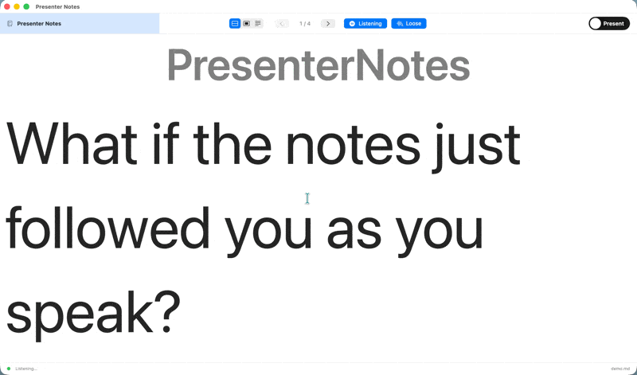
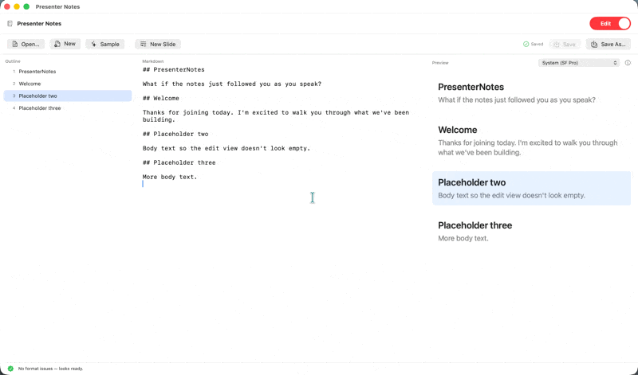
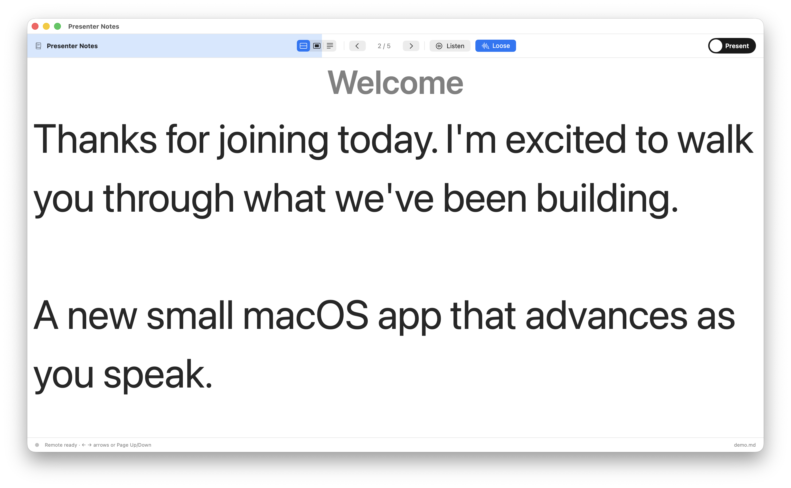

# PresenterNotes

> A focused macOS app that displays your presenter notes one slide at a time — and advances as you speak.

[](https://github.com/pardel/PresenterNotes/actions/workflows/ci.yml)
[](LICENSE)

- **Markdown-first.** Your script is a `.md` file. No proprietary format, no lock-in, your editor of choice.
- **Voice-driven.** When you speak the closing words of a chunk, the app advances. Paraphrase freely — the matcher is forgiving.
- **On-device.** Speech recognition never leaves your Mac.

## Install

### Homebrew

```sh
brew install --cask pardel/tap/presenternotes
```

### Direct download

Grab the latest `PresenterNotes-<version>.dmg` from [Releases](https://github.com/pardel/PresenterNotes/releases). Open the DMG and drag the app to `/Applications`. The build is signed and notarized, so it launches without Gatekeeper prompts.

### Build from source

Open `PresenterNotes.xcodeproj` in Xcode 15+, set your team in Signing & Capabilities, ⌘R. See [CONTRIBUTING.md](CONTRIBUTING.md) for the full developer setup.

## Tour

### Speech-driven auto-advance



Toggle **Listen** in Present mode. Speak normally. When you reach the closing line of the current chunk, the app advances. The matcher tolerates paraphrasing in the body — only the trailing signature (the last few words) needs to land.

### Edit mode with live validation



A three-pane editor (outline · source · preview). The slides format has five rules; every fixable violation has a one-click **Fix** button.

### Teleprompter / focused slide mode



Full-screen single-slide display, font sized to the window.

### Printable handouts

Hit ⌘P to print your notes as a portrait handout, or ⇧⌘P for landscape. Each chunk gets its title and body laid out on the page — useful for a paper backup, a PDF to hand round beforehand, or a teleprompter of last resort when the projector goes down.

## The slides format

Split your script into chunks with `## H2` headings. Five rules, enforced live in edit mode:

| # | Rule | Auto-fix |
|---|---|---|
| 1 | Chunks delimited by H2 | — |
| 2 | No H1 (`# ` would confuse the parser) | rewrites to `## ` |
| 3 | No H3 or deeper — use **bold** for in-chunk emphasis | converts to bold |
| 4 | Every H2 needs a non-empty title | inserts `## Untitled` |
| 5 | Every H2 chunk needs body text | (manual) |

Sample at [`sample-notes.md`](sample-notes.md). Use **Open Markdown…** to load your own.

## How the speech matcher works

Short version: the parser extracts the last N words of each chunk (the *trailing signature*). The recogniser keeps a rolling window of the last ~40 words you have said. When the trailing signature appears as a contiguous subsequence in the tail of that window, the app advances.

- Body matching tolerates `maxSkip = 3` between recognised words and written words, so paraphrasing one or two words does not lose the highlight.
- Advances throttled to once per second.
- Manual navigation resets the window.
- On-device only (`requiresOnDeviceRecognition = true`).

Long version: deep-dive on [pardel.dev](https://www.pardel.dev) — published with the launch.

## Keyboard shortcuts

| Shortcut | Action |
|---|---|
| ⌘N | New document |
| ⌘O | Open markdown… |
| ⌘S | Save |
| ⇧⌘S | Save as… |
| ⌘P | Print (portrait) |
| ⇧⌘P | Print (landscape) |
| ⌘1 | Present mode |
| ⌘2 | Edit mode |
| → / Page Down / Space | Next chunk |
| ← / Page Up / Delete | Previous chunk |

## Contributing

PRs welcome — especially small ones. See [CONTRIBUTING.md](CONTRIBUTING.md) and [docs/ARCHITECTURE.md](docs/ARCHITECTURE.md). Look for [`good first issue`](https://github.com/pardel/PresenterNotes/issues?q=is%3Aopen+label%3A%22good+first+issue%22).

Public roadmap: [ROADMAP.md](ROADMAP.md). Discussions: [github.com/pardel/PresenterNotes/discussions](https://github.com/pardel/PresenterNotes/discussions).

## Licence

MIT. See [LICENSE](LICENSE).
